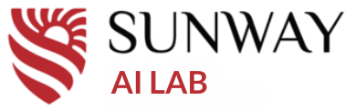

# Sunway AI Lab

<div style="width: 200px; height: 150px; overflow: hidden; margin: 0 auto;">
    
</div>

## Overview

Welcome to the official GitHub organization of **Sunway AI Lab**! This space hosts our open-source projects, research code, and collaborative AI developments.

## Research Focus

- 🔬 **Fundamental AI Research**
- 🖼️ **Computer Vision**
- 📝 **Natural Language Processing**
- ⚗️ **AI for Scientific Discovery**
- 🤖 **RPA**
- ⚖️ **Ethical & Responsible AI**

## Getting Started

### For Team Members

```bash
1. Request organization access from admin
2. Set up your SSH keys
3. Clone repositories of interest
4. Follow project-specific contribution guidelines
```
### For External Contributors
```
1. Find a Project: Explore our repositories below
2. Fork: Fork the repository you want to contribute to
3. Contribute: Make your changes and submit a pull request
4. Guidelines: Follow each project's specific contribution guidelines
```

### Active Projects

| Project                                  | Description                           | Tech Stack                          | Status  |
|------------------------------------------|---------------------------------------|-------------------------------------|---------|
| ATutorBot                                | AI-powered tutoring system            | Python, PyTorch, HuggingFace, FastAPI | Active  |
| Medical Image Interpreter                | Medical image analysis toolkit        | Python, TensorFlow, MONAI, DICOM    | Active  |
| Robotic Process Automation with Agentic AI for Finance | Financial document processing | Python, LangChain, OpenAI API, PDF parsers | Active  |
| Patient Management              | Patient Management Descision Making        | Python, SHAP, LIME, scikit-learn    | Active    |

# 📜 Contribution Guidelines

We welcome contributions! Please:

- Open an issue to discuss major changes
- Follow our coding standards:
  - **Python**: PEP 8 compliant
  - **Documentation**: NumPy style
  - **Tests**: pytest framework
- Keep commits atomic and well-described

# 🏛️ Team

**Leadership Team:**
- Director: [Khushal Regmi](https://github.com/khushalregmi) (@khushalregmi)
- Academic Co-ordinator: [Rupak Koirala](https://github.com/rupakkoirala) (@rupakkoirala)
- Research Lead: [Udit Kumar Mahato](https://github.com/uditmahato) (@uditmahato)

**Technical Steering Committee:**
- [Shankar Tamang](https://github.com/shankar-tamang) (@shankar-tamang) (Natural Language Processing)
- [Atithi Shrestha](https://github.com/atithishrestha123) (@atithishrestha123) (RPA Developer)
- [Sanket Shrestha](https://github.com/stha-sanket) (@stha-sanket) (Quality Assurance)
- [Ankit Mahato](https://github.com/mahatoankit) (@mahatoankit) (Computer Vision)
- [Prashant Aharya](https://github.com/Prashanta1524) (@Prashanta1524) (Computer Vision)

# 📬 Contact Us

**Email:** [ailab@sunway.edu.np](mailto:ailab@sunway.edu.np)  
**Website:** [https://sunway.edu.np](https://sunway.edu.np)  

**Address:**  
Sunway AI Lab
Third Florr , Block D
Sunway College Kathmandu
Behind Maitidevi Temple,
Kathmandu Nepal

# 📄 License

All projects are released under the **MIT License** unless otherwise specified.

<div align="center">
  <em>© 2024 Sunway AI Lab | Last updated: March 2025</em>
</div>
